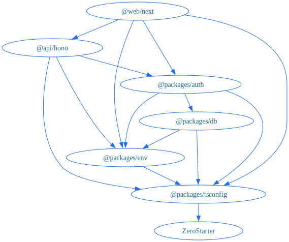

# ZeroStarter - The SaaS Starter

A modern, type-safe, and high-performance SaaS starter template built with a monorepo architecture.

- **📚 Documentation**: For comprehensive documentation, visit **[https://zerostarter.dev/docs](https://zerostarter.dev/docs)**.
- **🤖 AI/LLM Users**: For optimized documentation, use **[https://zerostarter.dev/llms.txt](https://zerostarter.dev/llms.txt)**.
- **🐦 X**: Follow **[@nrjdalal](https://twitter.com/nrjdalal)** for updates and don't forget to star the repository!

> [!IMPORTANT]
> ZeroStarter is currently in **Release Candidate (RC)** status. All implemented features are stable and production-ready. We're actively adding new features and integrations day-by-day.

## ⚙️ Architecture and Tech Stack

> [!NOTE]
> For detailed information about the architecture and tech stack, see the [Architecture documentation](https://zerostarter.dev/docs/getting-started/architecture).



- **Runtime & Build System**: [Bun](https://bun.sh) + [Turborepo](https://turbo.build)
- **Frontend**: [Next.js 16](https://nextjs.org)
- **Backend**: [Hono](https://hono.dev)
- **RPC**: [Hono Client](https://hono.dev/docs/guides/rpc) for end-to-end type safety with frontend client
- **Database**: [PostgreSQL](https://www.postgresql.org) with [Drizzle ORM](https://orm.drizzle.team)
- **Authentication**: [Better Auth](https://better-auth.com)
- **Analytics**: [PostHog](https://posthog.com) for product analytics, feature flags, and session recordings
- **Styling**: [Tailwind CSS](https://tailwindcss.com)
- **UI Components**: [Shadcn UI](https://ui.shadcn.com)
- **Data Fetching**: [TanStack Query](https://tanstack.com/query/latest)
- **Validation**: [Zod](https://zod.dev)
- **Bundling, Linting & Formatting**: [tsdown](https://tsdown.dev), [Oxlint](https://oxc.rs/docs/guide/usage/linter) and [Oxfmt](https://oxc.rs/docs/guide/usage/formatter)
- **API Documentation**: [Scalar](https://scalar.com) with auto-generated OpenAPI spec at `/api/docs`
- **Documentation**: [Fumadocs](https://fumadocs.dev) with auto-generated [llms.txt](https://zerostarter.dev/llms.txt)
- **Automated Releases**: Automatically updated [Changelog](https://github.com/nrjdalal/zerostarter/releases) on release

This project is a monorepo organized as follows:

```
.
├── api/
│   └── hono/      # Backend API server (Hono)
├── web/
│   └── next/      # Frontend application (Next.js)
└── packages/
    ├── auth/      # Shared authentication logic (Better Auth)
    ├── db/        # Database schema and Drizzle configuration
    ├── env/       # Type-safe environment variables
    └── tsconfig/  # Shared TypeScript configuration
```

📖 **[View full architecture →](https://zerostarter.dev/docs/getting-started/architecture)**

## 🗺️ Roadmap

We're actively working on integrations for AI, analytics, background tasks, email, payments, and more.

📖 **[View detailed roadmap →](https://zerostarter.dev/docs/getting-started/roadmap)**

## 🔥 Why ZeroStarter?

**Architecture & Best Practices as a Service** — ZeroStarter isn't just a starter template, it's a complete blueprint for building production-ready SaaS applications with battle-tested patterns and practices.

- **Modular Architecture** — Clean, plug-and-play packages that work independently or together. Swap components, extend functionality, or customize without breaking the system
- **End-to-End Type Safety** — Hono RPC ensures type safety from database to frontend. Catch errors at compile time, ship with confidence
- **Clean Code Practices** — Well-structured monorepo with separation of concerns, making it easy to understand, maintain, and scale
- **Production-Ready Performance** — Optimized with Bun runtime and Turborepo for blazing-fast development and builds
- **Beautiful UI Out of the Box** — Shadcn UI components with Tailwind CSS, ready to customize or use as-is
- **Enterprise-Grade Auth** — Better Auth integration with GitHub, Google, and more — fully configured and ready to extend
- **Comprehensive Documentation** — Every pattern, practice, and decision documented with Fumadocs and AI-optimized [llms.txt](https://zerostarter.dev/llms.txt)
- **Deploy-Ready** — Docker and Vercel configurations included, so you can ship to production in minutes, not days

📖 **[View full why ZeroStarter? →](https://zerostarter.dev)**

## 🔌 Type-Safe API Client

> [!NOTE]
> For comprehensive details and examples, see the [Type-Safe API documentation](https://zerostarter.dev/docs/getting-started/type-safe-api).

This starter utilizes [Hono RPC](https://hono.dev/docs/guides/rpc) to provide end-to-end type safety between the backend and frontend.

- **Backend**: Routes defined in `api/hono/src/routers` are exported as `AppType` at `api/hono/src/index.ts`.
- **Frontend**: The client at `web/next/src/lib/api/client.ts` infers `AppType` request/response types using `hono/client`.
- **API Docs**: Interactive API documentation available at `/api/docs` powered by [Scalar](https://scalar.com).

### Usage Example

```ts
import { apiClient } from "@/lib/api/client"

// Fully typed request and response
const res = await apiClient.health.$get()
const { data } = await res.json()
```

📖 **[Type-Safe API documentation→](https://zerostarter.dev/docs/getting-started/type-safe-api)**

## 🚀 Quick Start

```bash
# Clone the template
bunx gitpick https://github.com/nrjdalal/zerostarter/tree/main
cd zerostarter

# Install dependencies
bun install

# Set up environment variables (see docs)
cp .env.example .env

# Set up database
bun run db:generate
bun run db:migrate

# Start development
bun dev
```

📖 **[Complete installation guide →](https://zerostarter.dev/docs/getting-started/installation)**

## 📚 Documentation

- **[📖 Full Documentation](https://zerostarter.dev/docs)** — Everything you need to know
- **[🏗️ Architecture](https://zerostarter.dev/docs/getting-started/architecture)** — Deep dive into the tech stack
- **[📂 Project Structure](https://zerostarter.dev/docs/getting-started/project-structure)** — Monorepo organization
- **[🔌 Type-Safe API](https://zerostarter.dev/docs/getting-started/type-safe-api)** — Hono RPC client examples
- **[⚙️ Scripts](https://zerostarter.dev/docs/getting-started/scripts)** — Available commands
- **[🚀 Deployment](https://zerostarter.dev/docs/deployment/vercel)** — Deploy to production
- **[🤖 AI/LLM Users](https://zerostarter.dev/llms.txt)** — Optimized documentation

## 🤝 Contributing

Contributions are welcome! Please read our contributing guidelines first.

📖 **[View contributing guidelines →](https://zerostarter.dev/docs/contributing)**

## ❤️ Amazing Contributors

<a href="https://github.com/nrjdalal/zerostarter/graphs/contributors">
  
</a>

## 📄 License

MIT License — see [LICENSE.md](LICENSE.md) for details.

---

**⭐ Star this repo** if you find it helpful, and follow [@nrjdalal](https://twitter.com/nrjdalal) for updates!

<!-- trigger build: 7 -->
