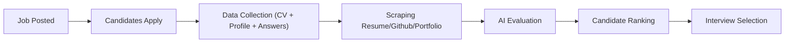

# Orizen Hiring Workflow

```mermaid
flowchart LR
    A["Job Posted"] --> B["Candidates Apply"]
    B --> C["Data Collection (CV + Profile + Answers)"]
    C --> D["Scraping Resume/Github/Portfolio"]
    D --> E["AI Evaluation"]
    E --> F["Candidate Ranking"]
    F --> G["Interview Selection"]
```

<!-- ## Notes

- Use this file for VS Code Markdown preview rendering.
- Keep `architecture.md` as raw Mermaid text for tools that expect Mermaid-only input. -->
