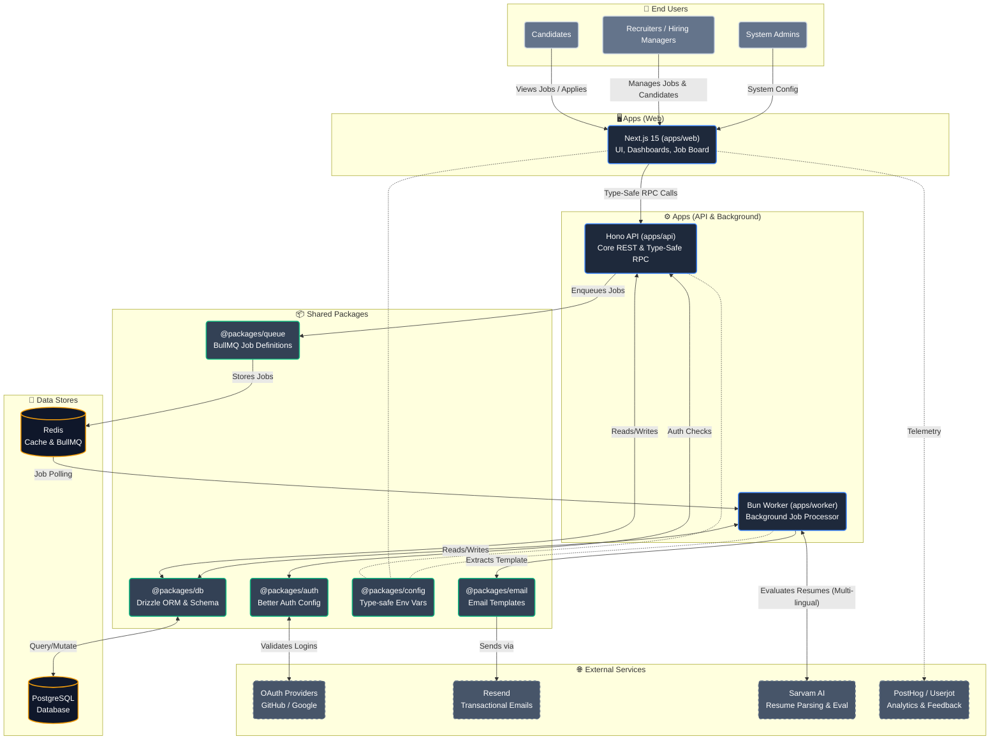

# Orizen Flow Architecture

Orizen Flow is a next-generation Applicant Tracking System (ATS) built with a modern, type-safe full-stack monorepo architecture. Below is a comprehensive architectural diagram outlining how the different applications, packages, and external services interact within the system.

## System Architecture Diagram

## Data Flow & Workflow

1. **User Interaction**: Users (Candidates, Recruiters, Admins) interact with the **Next.js frontend**.
2. **API Communication**: The frontend invokes the backend using a strongly-typed RPC client hooked into the **Hono API**.
3. **Authentication**: The API securely authenticates requests via **Better Auth** (configured in `@packages/auth`), integrating with GitHub/Google OAuth.
4. **Data Persistence**: Synchronous operations (fetching jobs, creating entries) are handled immediately via **Drizzle ORM** (`@packages/db`) to **PostgreSQL**.
5. **Background Processing**: For heavy tasks like Candidate Resume Parsing or Email notifications:
   - The Hono API enqueues a job into **Redis** via **BullMQ** (`@packages/queue`).
   - The dedicated **Bun Worker** picks up the job.
   - The worker integrates with **Sarvam AI** for advanced, multi-lingual resume parsing and scoring.
   - If a notification D --> E["Playwright-Based Validation"] D --> E["Playwright-Based Validation"] is needed, the worker constructs the email with `@packages/email` and dispatches it via **Resend**.
